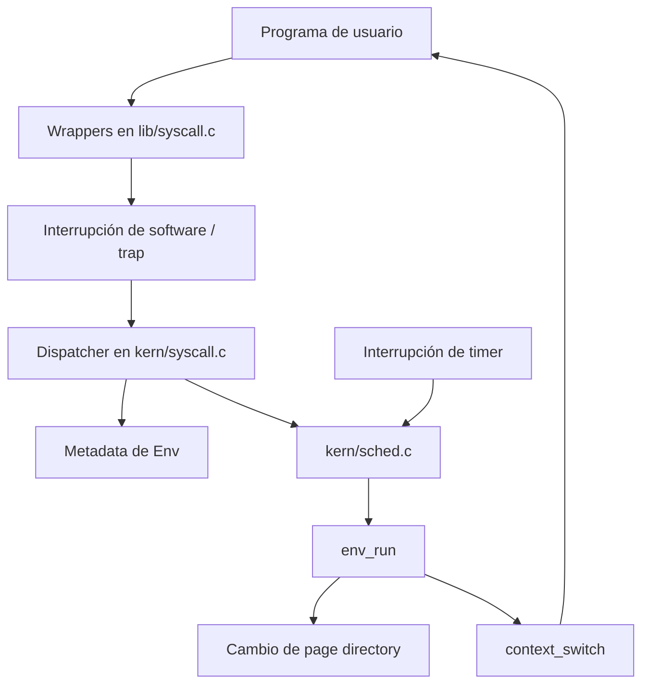
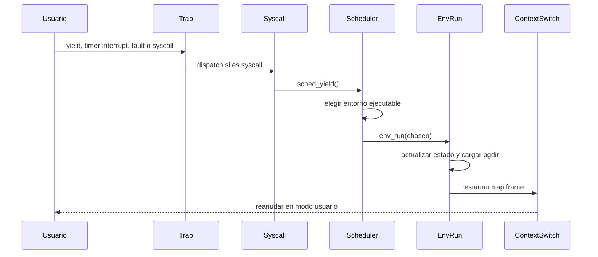

<p align="right">
  <a href="README.md">🇺🇸 English</a> | <strong>🇦🇷 Español</strong>
</p>

# Scheduler de CPU en C — Round-Robin y Planificación por Prioridades

<div align="center">


</div>

---

Proyecto de planificación de CPU a nivel kernel, escrito en C para un sistema operativo educativo x86. El repositorio implementa y compara **Round-Robin** y **planificación por prioridades**, extiende el modelo de procesos con metadata de prioridad en tiempo de ejecución, expone operaciones de prioridad mediante syscalls y valida el comportamiento con programas de usuario ejecutados en QEMU y un script automático de evaluación.

## Puntos destacados

> Proyecto académico de sistemas operativos enfocado en planificación de procesos, ejecución por traps, cambios de contexto, llamadas al sistema y manejo explícito de estado de bajo nivel.

- **Scheduler Round-Robin**: recorre los entornos ejecutables en orden circular, empezando después del entorno que corrió por última vez en la CPU.
- **Scheduler por prioridades**: selecciona el entorno ejecutable con mayor prioridad y conserva comportamiento Round-Robin entre entornos con la misma prioridad.
- **Ajuste dinámico de prioridades**: restablece prioridades periódicamente y reduce la prioridad de entornos CPU-bound después de interrupciones de timer.
- **Extensión del modelo de procesos**: agrega `env_priority` a la estructura `Env` y lo inicializa durante la creación de entornos.
- **Interfaz de syscalls**: expone consulta y modificación de prioridad mediante `SYS_env_get_prior` y `SYS_env_set_prior`.
- **Wrappers en espacio de usuario**: ofrece funciones de biblioteca para que los programas de usuario interactúen con la prioridad del scheduler.
- **Ejecución con QEMU**: compila y ejecuta el kernel y los programas de usuario desde el Makefile del proyecto.
- **Entorno containerizado**: incluye Dockerfile y script auxiliar para reproducir la toolchain de Linux.
- **Validación automática**: usa `grade-lab4` para ejecutar pruebas de scheduling, fork, IPC, page faults y escenarios con múltiples CPUs.

---

## Qué es

Este proyecto implementa comportamiento de planificación de CPU dentro de un sistema operativo educativo usado en la materia **Sistemas Operativos** de la Universidad de Buenos Aires.

El scheduler decide qué entorno de usuario debe ejecutarse a continuación cuando el kernel cede la CPU, recibe una interrupción de timer o necesita continuar luego de un cambio de estado de un proceso. El repositorio incluye dos modos de planificación:

- **Round-Robin**, donde los entornos ejecutables se seleccionan en orden circular.
- **Planificación por prioridades**, donde primero se busca la mayor prioridad disponible entre los entornos ejecutables y luego se rota de manera justa entre los entornos que comparten esa prioridad.

La implementación trabaja cerca del límite del kernel: modifica metadata de entornos, interactúa con el manejo de traps, cambia directorios de páginas durante cambios de contexto y finalmente reanuda ejecución en modo usuario mediante una rutina de context switch en assembly.

El código proviene de un laboratorio académico, por lo que conserva la estructura del enunciado original. Algunos detalles de implementación, comentarios y nombres reflejan ese contexto de aprendizaje más que un estilo de kernel productivo.

---

## Por qué importa

Aunque el proyecto es compacto, ejercita conceptos que aparecen en muchos sistemas donde la corrección depende de transiciones de estado explícitas y reglas de ejecución bien definidas:

- seleccionar trabajo desde un conjunto compartido de unidades ejecutables
- preservar equidad sin ignorar prioridades
- manejar preemption impulsada por timer
- exponer comportamiento de kernel mediante una frontera controlada de syscalls
- mantener metadata de procesos consistente durante creación, ejecución, bloqueo y destrucción
- validar comportamiento de bajo nivel con programas de usuario determinísticos
- ejecutar el mismo sistema bajo distintas configuraciones de compilación

---

## Comportamiento del scheduler

### Round-Robin

La implementación Round-Robin vive en `sched/kern/sched.c`.

El scheduler:

1. Empieza a buscar inmediatamente después del entorno actual.
2. Recorre el array `envs` buscando un entorno `ENV_RUNNABLE`.
3. Vuelve al comienzo del array si es necesario.
4. Reutiliza el entorno actual solo cuando no hay otro entorno ejecutable y el actual sigue en estado `ENV_RUNNING`.
5. Detiene la CPU cuando no queda trabajo ejecutable.

Esto mantiene una ejecución simple y predecible, evitando seleccionar repetidamente el mismo entorno cuando otros están listos.

### Planificación por prioridades

El scheduler por prioridades se habilita en compilación con `USE_PR=1`.

El scheduler:

1. Restablece periódicamente todas las prioridades a `ENV_DEFAULT_PRIORITY`.
2. Reduce la prioridad del entorno actual después de ejecución impulsada por timer cuando corresponde.
3. Busca la prioridad más alta disponible entre los entornos ejecutables.
4. Selecciona el siguiente entorno con esa prioridad, empezando después del entorno actual.
5. Vuelve al comienzo de la tabla para preservar equidad entre entornos con igual prioridad.

Este diseño evita que un único proceso monopolice permanentemente un nivel de prioridad, pero permite que la prioridad influya en la asignación de CPU.

---

## Arquitectura

La mayor parte de la lógica del scheduler está en el kernel. El acceso desde programas de usuario se mantiene acotado mediante syscalls y la biblioteca de soporte en espacio de usuario.



### Capa de kernel

La capa de kernel vive principalmente en `sched/kern`.

Responsabilidades principales:

- planificar entornos ejecutables
- mantener el puntero al entorno actual
- actualizar contadores de ejecución
- cambiar el address space antes de reanudar código de usuario
- manejar interrupciones de timer y yields explícitos
- despachar syscalls desde modo usuario
- detener la CPU cuando no quedan entornos ejecutables

Archivos importantes:

- `sched/kern/sched.c`: implementaciones de Round-Robin y scheduling por prioridades.
- `sched/kern/env.c`: creación, inicialización, destrucción, carga de page directory y entrada al context switch.
- `sched/kern/syscall.c`: dispatcher e implementaciones de syscalls en kernel.
- `sched/kern/trap.c`: manejo de traps e interrupciones que eventualmente devuelve control al scheduler.
- `sched/kern/sched.h`: interfaz del scheduler usada por el resto del kernel.

### Interfaz compartida

Los headers compartidos viven en `sched/inc`.

Archivos importantes:

- `sched/inc/env.h`: define `struct Env`, estados de proceso, IDs de entorno y prioridad por defecto.
- `sched/inc/syscall.h`: define números de syscalls, incluidas las syscalls de prioridad del scheduler.
- `sched/inc/lib.h`: declara los wrappers de syscalls disponibles para programas de usuario.

### Soporte en espacio de usuario

La biblioteca de usuario y los programas de prueba viven en `sched/lib` y `sched/user`.

Archivos importantes:

- `sched/lib/syscall.c`: stubs de syscalls respaldados por assembly.
- `sched/lib/fork.c`: implementación de fork en espacio de usuario usada por varias pruebas.
- `sched/user/yield.c`: valida comportamiento de yield cooperativo.
- `sched/user/stresssched.c`: estresa el scheduling con múltiples CPUs.
- `sched/user/fairness.c`: explora equidad de scheduling con programas intensivos en IPC.
- `sched/user/intensemath.c`: imprime la prioridad en ejecución mientras realiza trabajo intensivo de CPU.

---

## Flujo principal

A alto nivel, la ejecución del scheduler sigue esta secuencia:

1. Un programa de usuario hace yield, se bloquea, termina, falla o es interrumpido por un timer.
2. El camino de trap entra al kernel.
3. El kernel actualiza el estado del entorno cuando corresponde.
4. `sched_yield()` busca el siguiente entorno según la política de scheduling seleccionada.
5. `env_run()` marca el entorno elegido como running.
6. El kernel carga el page directory del entorno elegido.
7. `context_switch()` restaura el trap frame guardado.
8. La ejecución continúa en modo usuario.



---

## Detalles técnicos

- **Lenguaje**: C con integración de assembly x86.
- **Target de ejecución**: kernel educativo x86 de 32 bits.
- **Emulación**: QEMU.
- **Build system**: GNU Make.
- **Selección de scheduler**: flags de compilación en `sched/GNUmakefile`.
- **Política por defecto**: Round-Robin cuando no se pasa ningún flag.
- **Tabla de procesos**: array fijo `envs` con `NENV` entradas.
- **Estados de proceso**: `ENV_FREE`, `ENV_DYING`, `ENV_RUNNABLE`, `ENV_RUNNING` y `ENV_NOT_RUNNABLE`.
- **Prioridad por defecto**: `ENV_DEFAULT_PRIORITY`.
- **Camino de context switch**: `env_run()` carga el estado del proceso y llama a `context_switch()`.
- **Validación**: pruebas basadas en QEMU mediante `grade-lab4`.

---

## Estructura del proyecto

```text
.
├── README.md
├── README.es.md
├── .pre-commit-config.yaml
├── .github/
│   └── workflows/
│       └── pre-commit-check.yaml
└── sched/
    ├── Dockerfile
    ├── GNUmakefile
    ├── dock
    ├── grade-lab4
    ├── gradelib.py
    ├── sched.md
    ├── inc/
    │   ├── env.h
    │   ├── lib.h
    │   ├── syscall.h
    │   └── ...
    ├── kern/
    │   ├── env.c
    │   ├── sched.c
    │   ├── syscall.c
    │   ├── trap.c
    │   └── ...
    ├── lib/
    │   ├── fork.c
    │   ├── syscall.c
    │   └── ...
    ├── user/
    │   ├── fairness.c
    │   ├── intensemath.c
    │   ├── stresssched.c
    │   ├── yield.c
    │   └── ...
    └── fs/
        └── ...
```

---

## Inicio rápido

### Requisitos

Entorno recomendado:

- Linux
- GNU Make
- GCC o una toolchain compatible con `i386-jos-elf`
- QEMU para emulación de sistema i386
- Python 3 para el script de evaluación
- Docker, opcionalmente, para usar el entorno containerizado incluido

En hosts que no sean Linux, el flujo con Docker es la forma más conveniente de evitar diferencias de toolchain local.

### Usando Docker

Desde el directorio `sched`:

```bash
./dock build
./dock run
```

Dentro del contenedor:

```bash
make
make grade
make qemu-nox
```

En otra terminal, para entrar al contenedor en ejecución:

```bash
./dock exec
```

### Compilar

Desde el directorio `sched`:

```bash
make
```

Por defecto, el Makefile compila el scheduler Round-Robin.

### Ejecutar en QEMU

```bash
make qemu-nox
```

### Ejecutar las pruebas automáticas

```bash
make grade
```

### Compilar con un scheduler específico

Round-Robin:

```bash
make USE_RR=1
```

Scheduler por prioridades:

```bash
make USE_PR=1
```

Los mismos flags pueden combinarse con otros targets de Make:

```bash
make grade USE_PR=1
make qemu-nox USE_RR=1
```

---

## Comandos útiles

```bash
# Compilar el kernel por defecto
make

# Ejecutar sin ventana gráfica de QEMU
make qemu-nox

# Ejecutar la suite de pruebas del lab
make grade

# Ejecutar un programa de usuario específico
make run-yield-nox
make run-stresssched-nox

# Ejecutar con múltiples CPUs emuladas
make run-stresssched-nox CPUS=4

# Formatear archivos C con clang-format
make format

# Limpiar artefactos de compilación
make clean
```

---

## Limitaciones actuales

Este repositorio conserva la forma de un laboratorio académico de sistemas.

- El proyecto está atado a un kernel educativo y no busca ser un sistema operativo de propósito general.
- La elección del scheduler se hace en compilación, no en tiempo de ejecución.
- El sistema de prioridades es deliberadamente pequeño y está pensado para experimentación de laboratorio.
- La suite de pruebas valida salida de QEMU, útil para el trabajo práctico pero no equivalente a una estrategia completa de verificación.
- Algunos comentarios y decisiones de implementación reflejan el enunciado original del laboratorio.
- La documentación en `sched/sched.md` incluye notas de GDB y diagramas del proceso de depuración.

---

## Aprendizajes de diseño

Este proyecto demuestra:

- programación de bajo nivel en C
- cambios en estructuras de datos de kernel
- manejo de estado de procesos
- implementación de políticas de scheduling
- preemption impulsada por interrupciones de timer
- integración con cambio de contexto
- diseño y dispatch de syscalls
- manejo de la frontera usuario/kernel
- validación con QEMU
- desarrollo reproducible con Docker

---

## Estado

**Proyecto académico completo de sistemas operativos.**

El repositorio se conserva como una implementación compacta de conceptos de planificación de CPU en un kernel x86 pequeño: selección Round-Robin, selección por prioridades, metadata de entornos, integración con syscalls, wrappers en espacio de usuario y pruebas basadas en QEMU.
