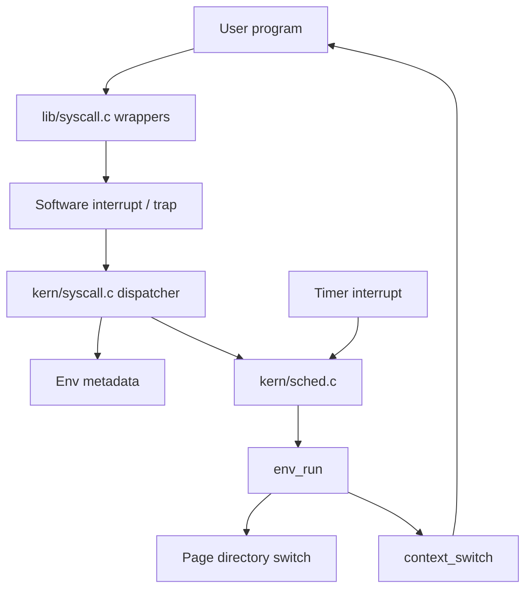
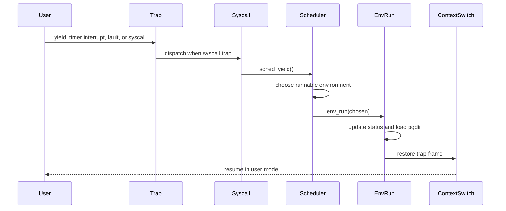

<p align="right">
  <strong>🇺🇸 English</strong> | <a href="README.es.md">🇦🇷 Español</a>
</p>

# CPU Scheduler in C — Round-Robin and Priority Scheduling

<div align="center">


</div>

---

A kernel-level CPU scheduling project written in C for an educational x86 operating system. The repository implements and compares **Round-Robin** and **priority-based** scheduling, extends the process environment model with runtime priority metadata, exposes priority operations through system calls, and validates behavior through QEMU-based user programs and an automated grading script.

## Highlights

> Academic operating systems project focused on process scheduling, trap-driven execution, context switching, system calls, and low-level state management.

- **Round-Robin scheduler**: scans runnable environments in circular order, starting after the environment that last ran on the CPU.
- **Priority scheduler**: selects the highest-priority runnable environment while preserving Round-Robin behavior among environments with the same priority.
- **Priority aging and demotion**: resets priorities periodically and lowers the priority of CPU-bound environments after timer interrupts.
- **Kernel process model extension**: adds `env_priority` to the `Env` structure and initializes it during environment allocation.
- **System call interface**: exposes priority inspection and updates through `SYS_env_get_prior` and `SYS_env_set_prior`.
- **User-space syscall wrappers**: provides library functions so user programs can interact with scheduler priority from outside the kernel.
- **QEMU execution workflow**: builds and runs the kernel and user programs through the project Makefile.
- **Containerized environment**: includes a Dockerfile and helper script for a reproducible Linux toolchain.
- **Automated validation**: uses `grade-lab4` to run scheduling, forking, IPC, page fault, and multicore-oriented tests.

---

## What It Is

This project is an implementation of CPU scheduling behavior inside a small educational operating system used in the **Operating Systems** course at the University of Buenos Aires.

The scheduler is responsible for choosing which user environment should run next whenever the kernel yields, receives a timer interrupt, or needs to continue execution after a process changes state. The repository includes two scheduling modes:

- **Round-Robin**, where runnable environments are selected in circular order.
- **Priority-based scheduling**, where the scheduler first finds the highest priority among runnable environments and then rotates fairly among environments at that priority level.

The implementation works close to the kernel boundary: it modifies environment metadata, interacts with trap handling, switches page directories during context changes, and ultimately resumes user-mode execution through an assembly context switch.

The code comes from an academic lab, so it intentionally remains close to the assignment structure. Some implementation details, comments, and naming choices reflect that learning context rather than production kernel style.

---

## Why it matters

Although the project is compact, it exercises concepts that appear in many systems where correctness depends on explicit state transitions and well-defined execution rules:

- selecting work from a shared pool of runnable units
- preserving fairness while still honoring priority
- handling timer-driven preemption
- exposing kernel behavior through a controlled syscall boundary
- keeping process metadata consistent across creation, execution, blocking, and destruction
- validating low-level behavior through deterministic user programs
- running the same system under different compile-time configurations

---

## Scheduling Behavior

### Round-Robin

The Round-Robin implementation lives in `sched/kern/sched.c`.

The scheduler:

1. Starts searching immediately after the current environment.
2. Walks through the `envs` array looking for `ENV_RUNNABLE`.
3. Wraps around to the beginning of the array if needed.
4. Reuses the current environment only when no other environment is runnable and the current one is still `ENV_RUNNING`.
5. Halts the CPU when there is no runnable work left.

This keeps execution simple and predictable while avoiding repeatedly selecting the same environment when others are ready.

### Priority Scheduling

The priority scheduler is enabled at compile time with `USE_PR=1`.

The scheduler:

1. Periodically resets all environment priorities to `ENV_DEFAULT_PRIORITY`.
2. Decreases the current environment priority after timer-driven execution when possible.
3. Finds the highest priority currently available among runnable environments.
4. Selects the next environment at that priority, starting after the current environment.
5. Wraps around the environment table to preserve fairness between equal-priority environments.

This design prevents one priority level from becoming a permanent single-process monopoly while still allowing priority to influence CPU allocation.

---

## Architecture

The project keeps most scheduler-related logic in the kernel, while exposing a narrow interface to user programs through syscalls and the user-space support library.



### Kernel Layer

The kernel layer lives mainly under `sched/kern`.

Key responsibilities:

- schedule runnable environments
- maintain the current environment pointer
- update process run counters
- switch address spaces before resuming user code
- handle timer interrupts and explicit yields
- dispatch system calls from user mode
- halt the CPU when no runnable environments remain

Important files:

- `sched/kern/sched.c`: Round-Robin and priority scheduling implementations.
- `sched/kern/env.c`: environment allocation, initialization, destruction, page-directory loading, and context-switch entry point.
- `sched/kern/syscall.c`: kernel-side syscall dispatcher and syscall implementations.
- `sched/kern/trap.c`: trap and interrupt handling that eventually hands control back to the scheduler.
- `sched/kern/sched.h`: scheduler interface used by the rest of the kernel.

### Shared Interface

Shared headers live under `sched/inc`.

Important files:

- `sched/inc/env.h`: defines `struct Env`, process states, environment IDs, and the default priority.
- `sched/inc/syscall.h`: defines syscall numbers, including scheduler priority syscalls.
- `sched/inc/lib.h`: declares the user-space syscall wrappers available to user programs.

### User-Space Support

The user library and test programs live under `sched/lib` and `sched/user`.

Important files:

- `sched/lib/syscall.c`: assembly-backed syscall stubs used by user programs.
- `sched/lib/fork.c`: user-space fork implementation used by several tests.
- `sched/user/yield.c`: validates cooperative yielding behavior.
- `sched/user/stresssched.c`: stresses scheduling across multiple CPUs.
- `sched/user/fairness.c`: explores scheduling fairness with IPC-heavy programs.
- `sched/user/intensemath.c`: prints runtime priority while running CPU-intensive work.

---

## Core Flow

At a high level, scheduler execution follows this sequence:

1. A user program yields, blocks, exits, faults, or is interrupted by a timer.
2. The trap path enters the kernel.
3. The kernel updates environment state when needed.
4. `sched_yield()` searches for the next environment according to the selected scheduling policy.
5. `env_run()` marks the chosen environment as running.
6. The kernel loads the chosen environment page directory.
7. `context_switch()` restores the saved trap frame.
8. Execution resumes in user mode.



---

## Technical Details

- **Language**: C with x86 assembly integration.
- **Execution target**: 32-bit x86 educational kernel.
- **Emulation**: QEMU.
- **Build system**: GNU Make.
- **Scheduler selection**: compile-time flags in `sched/GNUmakefile`.
- **Default policy**: Round-Robin when no scheduler flag is provided.
- **Process table**: fixed-size `envs` array with `NENV` entries.
- **Process states**: `ENV_FREE`, `ENV_DYING`, `ENV_RUNNABLE`, `ENV_RUNNING`, and `ENV_NOT_RUNNABLE`.
- **Priority default**: `ENV_DEFAULT_PRIORITY`.
- **Context switch path**: `env_run()` loads process state and calls `context_switch()`.
- **Validation**: QEMU-based tests through `grade-lab4`.

---

## Project Structure

```text
.
├── README.md
├── README.es.md
├── .pre-commit-config.yaml
├── .github/
│   └── workflows/
│       └── pre-commit-check.yaml
└── sched/
    ├── Dockerfile
    ├── GNUmakefile
    ├── dock
    ├── grade-lab4
    ├── gradelib.py
    ├── sched.md
    ├── inc/
    │   ├── env.h
    │   ├── lib.h
    │   ├── syscall.h
    │   └── ...
    ├── kern/
    │   ├── env.c
    │   ├── sched.c
    │   ├── syscall.c
    │   ├── trap.c
    │   └── ...
    ├── lib/
    │   ├── fork.c
    │   ├── syscall.c
    │   └── ...
    ├── user/
    │   ├── fairness.c
    │   ├── intensemath.c
    │   ├── stresssched.c
    │   ├── yield.c
    │   └── ...
    └── fs/
        └── ...
```

---

## Quick Start

### Requirements

Recommended environment:

- Linux
- GNU Make
- GCC or an `i386-jos-elf` compatible toolchain
- QEMU for i386 system emulation
- Python 3 for the grading script
- Docker, optionally, for the included container workflow

On non-Linux hosts, the Docker workflow is the most convenient way to avoid local toolchain differences.

### Using Docker

From the `sched` directory:

```bash
./dock build
./dock run
```

Inside the container:

```bash
make
make grade
make qemu-nox
```

In another terminal, attach to the running container:

```bash
./dock exec
```

### Build

From the `sched` directory:

```bash
make
```

By default, the Makefile compiles the Round-Robin scheduler.

### Run in QEMU

```bash
make qemu-nox
```

### Run the Automated Tests

```bash
make grade
```

### Build With a Specific Scheduler

Round-Robin:

```bash
make USE_RR=1
```

Priority scheduler:

```bash
make USE_PR=1
```

The same flags can be combined with other Make targets:

```bash
make grade USE_PR=1
make qemu-nox USE_RR=1
```

---

## Useful Commands

```bash
# Build the default kernel
make

# Run without a graphical QEMU window
make qemu-nox

# Run the lab test suite
make grade

# Run a specific user program
make run-yield-nox
make run-stresssched-nox

# Run with multiple emulated CPUs
make run-stresssched-nox CPUS=4

# Format C files through clang-format
make format

# Clean build artifacts
make clean
```

---

## Current Limitations

This repository preserves the shape of an academic systems lab.

- The project is tied to an educational kernel and is not intended to be a general-purpose operating system.
- Scheduler choice is compile-time based rather than runtime configurable.
- The priority system is intentionally small and designed for lab-level experimentation.
- The test suite is driven by QEMU output matching, which is useful for the assignment but not a full verification strategy.
- Some comments and implementation choices reflect the original lab prompts.
- Documentation in `sched/sched.md` includes GDB notes and diagrams from the debugging process.

---

## Design Takeaways

This project demonstrates:

- low-level C programming
- kernel data-structure changes
- process state management
- scheduler policy implementation
- timer-interrupt driven preemption
- context-switch integration
- syscall design and dispatch
- user/kernel boundary handling
- QEMU-based validation workflows
- reproducible development with Docker

---

## Status

**Complete academic operating systems project.**

The repository is kept as a compact implementation of CPU scheduling concepts in a small x86 kernel: Round-Robin selection, priority-based selection, environment metadata, syscall integration, user-space wrappers, and QEMU-based testing.
