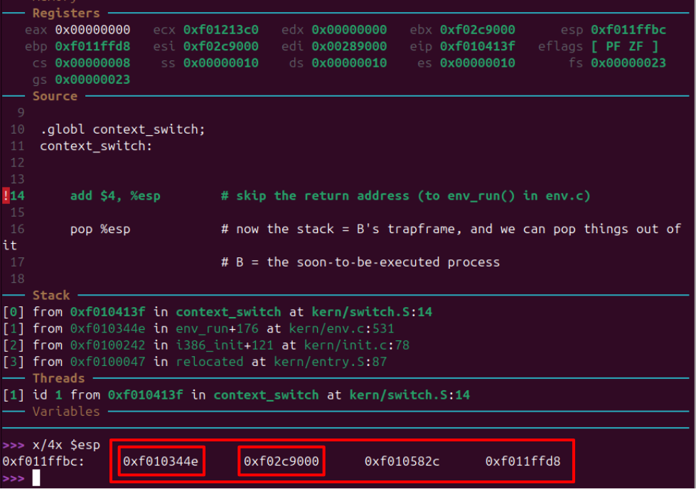
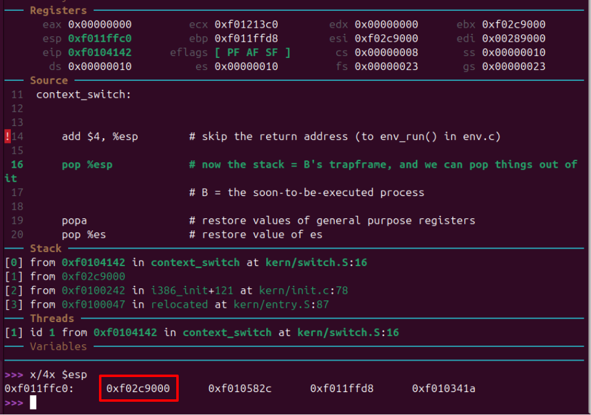
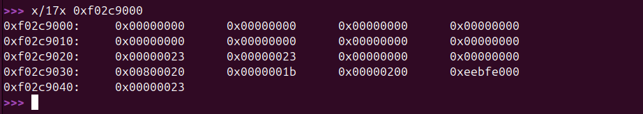
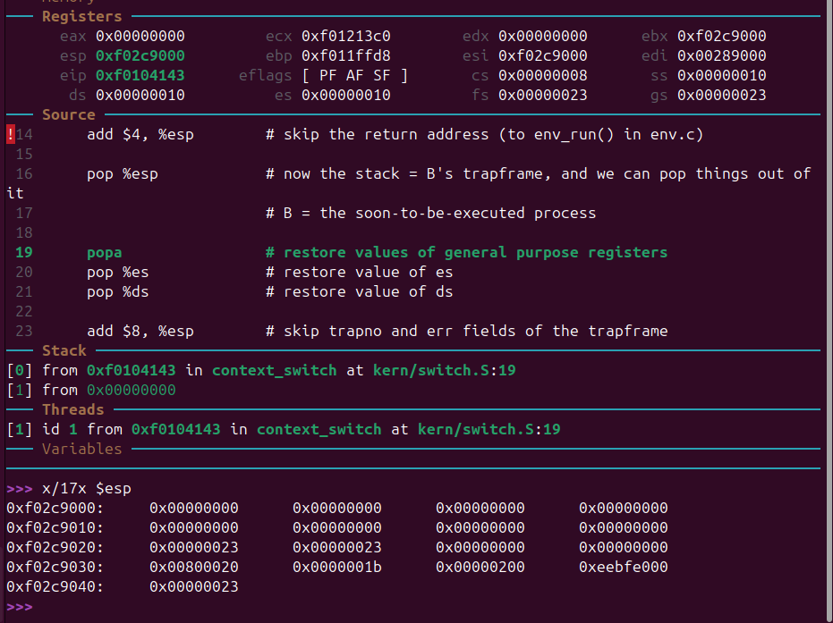
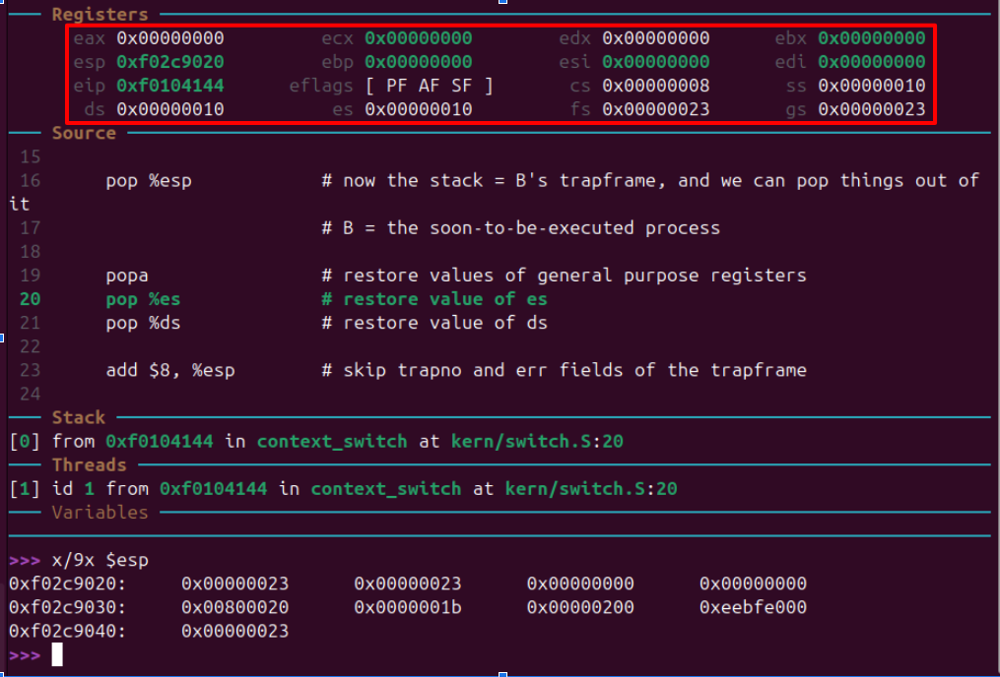
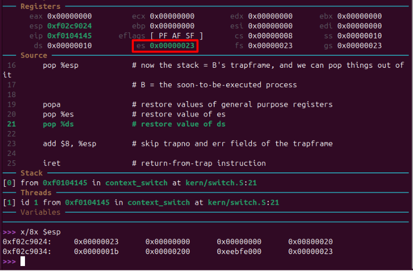
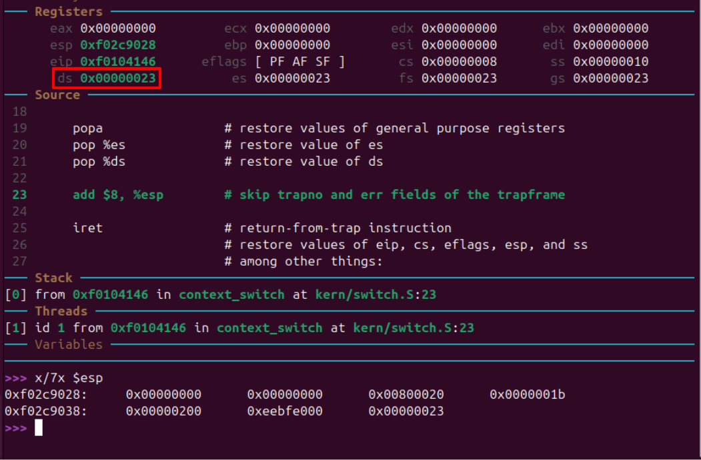
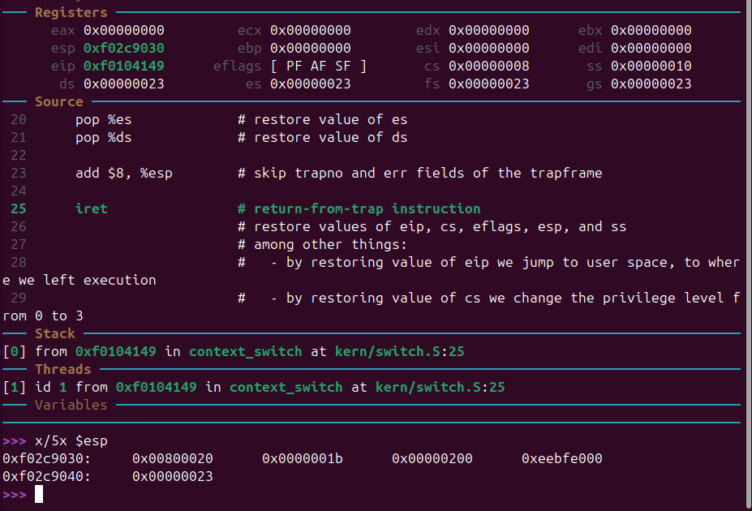
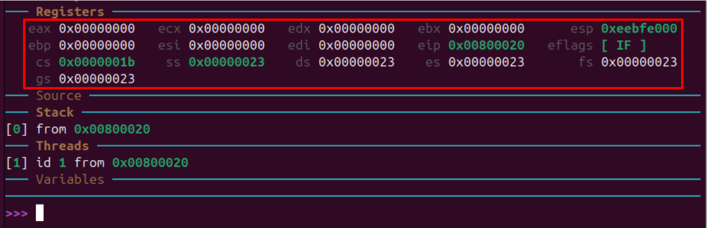

# sched

El estado del stack al inicio de la llamada a context_switch. La primera dirección es la return address y la segunda la
dirección al trapframe:

Ejecutamos la 'add', omitiendo la return address. Ahora tenemos en el tope del stack a la dirección del trapframe:

Si inspeccionamos esa dirección, vemos que efectivamente es el trapframe:

Ejecutamos el 'pop', y ahora el stack es el trapframe. Verificamos que el contenido coincide con el contenido
previamente inspeccionado:

Ejecutamos 'popa' y se restauran los registros de uso general:

Ejecutamos el siguiente 'pop' y se restaura `es`:

Ejecutamos el siguiente 'pop' y se restaura `ds`:

Ejecutamos la 'add' y nos salteamos los campos trapno y err:

Finalmente se ejecuta 'iret' y se restauran los registros especiales:

De aquí en adelante se ejecutan instrucciones en espacio de usuario

- `eip` apunta a la instrucción sobre la cual se debe reanudar la ejecución del programa de usuario
- `cs` indicaría que estamos en ring 3 (*)
- `eflags` recupera el estado de la ALU del programa de usuario
- `esp` apunta al stack del usuario

(*)
`cs` = 0000001b [16] = 0000 0000 0000 0000 0000 0000 0001 10**11** [2]

---

# Scheduler con prioridades

El scheduler busca la mayor prioridad de entre todos los procesos.
Luego, si hay un proceso actual, comienza a buscar a partir de él un proceso con la prioridad encontrada en el anterior
paso que este a la "derecha" de este, para asi poder hacer un round robin entre los procesos con la misma
prioridad.
Si no lo encuentra, comienza desde el principio del array hasta llegar al proceso actual.
Si no hay un proceso actual, comienza a buscar desde el principio del array.